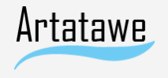

Artatawe is a group project developed as a part of CS-230 and CS-235 Software Engineering modules at Swansea University.

The project consisted of developing an auctioning portal dedicated to art. We worked in a group of 6 and our objective was to perform all phases of development lifecycle starting with planning, creating specification and performing a requirement analysis following with system and interface design and implementation, ending with testing and a simulated maintenance phase where we swapped projects with a different group and added functionality to their project.

To compile use:
mvn package
java -cp target/Artatawe-1.0.jar artatawe.MainHandler